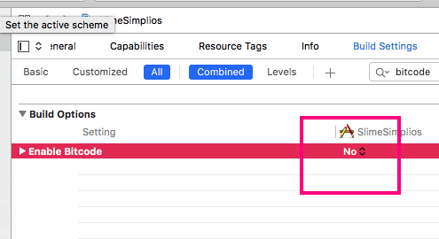
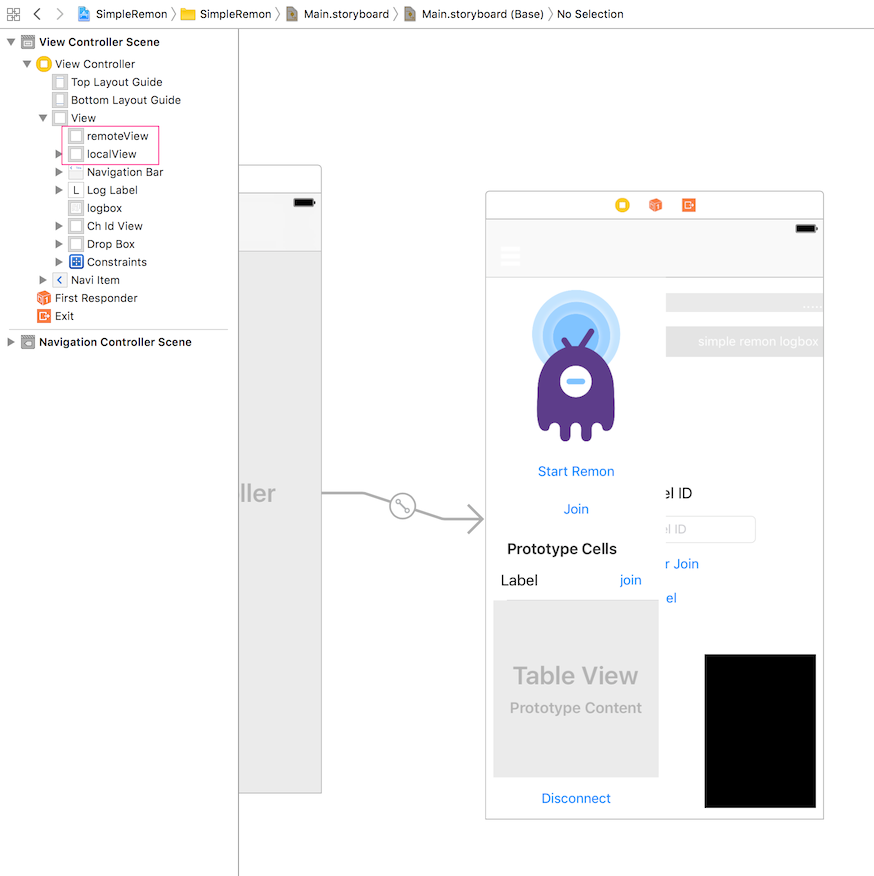

# iOS SDK - Getting Started

## 준비 사항
- Cocoapods 설치
  - RemoteMonster의 iOS SDK를 설치하기 이전에 먼저 [Cocoapods](https://cocoapods.org/)를 설치해야 합니다. Cocoapods는 애플의 iOS, MacOS환경에서 개발용 패키지 의존성을 관리하는 도구입니다.
- Xcode 개발 환경
- iOS 9.5 이상

## 프로젝트 생성 및 설정
- Xcode에서 Swift기반의 프로젝트를 하나 생성합니다.
- 프로젝트 생성 후 Build Settings에서 bitcode에 대하여 No를 설정해야 합니다.



- 또한 Info.plist에서 다음 항목에 대해 추가 혹은 변경을 해주셔야 합니다.
  - Privacy: Bluetooth, Microphone, Camera
  - App Transport Security Settings: Allow Arbitrary Loads=YES


## RemoteMonster iOS SDK import하기
- 다운로드받은 RemoteMonster iOS SDK를 압축을 풀어서 부모 디렉토리를 Finder에서 끌어다 프로젝트 트리창에 놓습니다. 그러면 RemoteMonster iOS SDK를 프레임워크로 인식하게 됩니다.


## Cocoapods 설정
- 이제 Cocoapods의 설정파일인 Podfile을 생성할 차례입니다. 터미널을 열어서 프로젝트 파일이 있는 곳에서 다음과 같이 명령을 실행하여 Podfile을 생성합니다.
  - `pod init`
- Podfile을 편집기에서 열어서 다음과 같이 몇몇 라이브러리를 다운로드할 수 있도록 수정합니다.
  - `pod "libjingle_peerconnection"`
  - `pod "SocketRocket"`
- 이제 터미널에서 다시 다음과 같이 명령을 실행합니다.
  - `pod install`
- pod install을 실행하면 별도의 workspace파일이 생성됩니다. 따라서 앞으로는 생성된 workspace파일을 기반으로 개발을 진행합니다. xcode창을 닫고 다시 이 workspace파일을 클릭하여 실행합니다.
- 그리고 clean하고 build를 해봅니다.


## 레이아웃 구성
- 스토리보드에서 원하는 Scene에서 적당히 버튼을 배치하고 영상통화를 할 경우 다음과 같이 View하나를 화면에 위치시킨 후 그것의 Class를 RTCEAGLVideoView로 지정합니다.


- 이제 거의 완료되었습니다. 전체적인 화면 구성은 다음과 같습니다.




## 개발
- 개발은 생각보다 간단합니다. ViewController를 선택하여 다음과 같이 코드를 작성합니다.

```swift
import UIKit
import remoniosv1

class ViewController: UIViewController, RemonDelegate {

    var remon:Remon?
    var localVideoTrack:RTCVideoTrack?
    var remoteVideoTrack:RTCVideoTrack?

    @IBOutlet weak var remoteView: RTCEAGLVideoView!
    @IBOutlet weak var localView: RTCEAGLVideoView!

    override func viewDidLoad() {
        super.viewDidLoad()
        let config = RemonConfig()
        config.key = "1234567890"
        config.serviceId = "SERVICEID1"
        remon = Remon(delegate: self, config: config)
    }

    override func didReceiveMemoryWarning() {
        super.didReceiveMemoryWarning()
    }

    @IBAction func onClickConnectButton(_ sender: Any) {
      remon?.connectChannel(chId: "simpleRemon")
    }

    @IBAction func onClickDisconnectButton(_ sender: Any) {
      remon?.disconnect()
    }

    func onStateChange(_ state:RemonState){
        print("State: \(state)")
    }
    func didReceiveLocalVideoTrack(_ localVideoTrack:RTCVideoTrack){
        print ("local video track is occured")
        self.localVideoTrack = localVideoTrack
        self.localVideoTrack?.add(localView)
    }
    func didReceiveRemoteVideoTrack(_ remoteVideoTrack:RTCVideoTrack){
        print ("Remote Video Track is occured")
        self.remoteVideoTrack = remoteVideoTrack
        self.remoteVideoTrack?.add(remoteView)
    }

    func onError(_ error:Error){
        print ("Error: \(error)")
    }

}
```


## import 그리고 주요 클래스
- Remotemonster의 iOS SDK를 사용하기 위해서는 일단 remoniosv1을 import하여야 합니다.
- 다음은 Remotemonster SDK의 주요 클래스입니다.
- Remon
  - Remon은 가장 핵심이 되는 클래스입니다. 이를 통해 RemoteMonster의 대부분의 기능을 실행합니다. 초기화하고 연결하고 종료하는 일련의 명령을 수행합니다.
- RemonDelegate
  - RemoteMonster의 이벤트를 처리하는 protocol입니다. Remote Monster를 통해 오고가는 모든 통신과정의 이벤트를 수신할 필요가 있습니다. 이를 위해 RemonDelegate를 사용합니다.
 - RemonDelegate를 통해 처리해야하는 메소드는 다음과 같습니다.
   - onStateChange: 최초 Remon객체를 만들고 방을 만들며 접속하고 접속에 성공하고 통신을 마칠 때까지의 모든 상태 변화에 대해 처리하는 메소드입니다. RemonState 객체를 통해 어떤 상태로 변경되었는지를 알려줍니다. RemonState의 상태는 다음과 같습니다.
    - INIT(시작), WAIT(방 생성), CONNECT(방 접속), COMPLETE(통신 연결완료), FAIL(실패), CLOSE(종료)
    - onError: 통신 시도 중 장애 발생시 호출됩니다.
    - didReceiveLocalVideoTrack: 자기 자신의 카메라의 영상이 혹은 음성 스트림을 획득하였을 경우 호출됩니다.
    - didReceiveRemoteVideoTrack: 상대방의 영상이나 음성 스트림을 획득하였을 경우 호출됩니다. 연결이 되었다는 뜻이죠.
- RemonConfig
  - Remon을 init하기 전에 Remon을 사용하기 위한 설정을 하는 클래스입니다. secretkey를 설정하거나 serviceId를 설정하고 영상통화를 사용할지 여부 등을 설정합니다.
