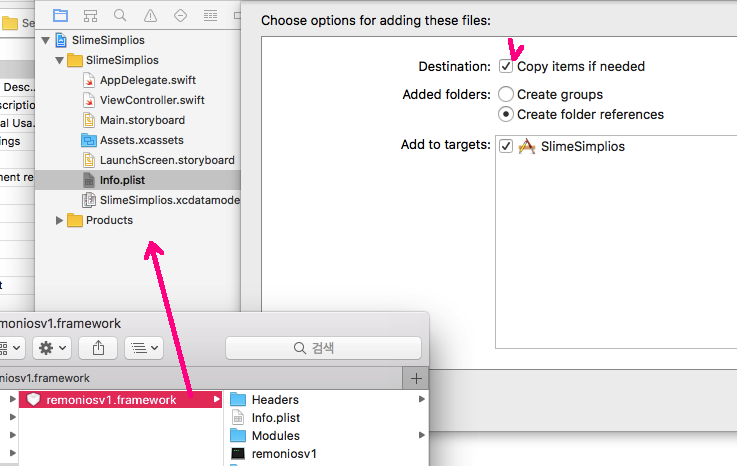
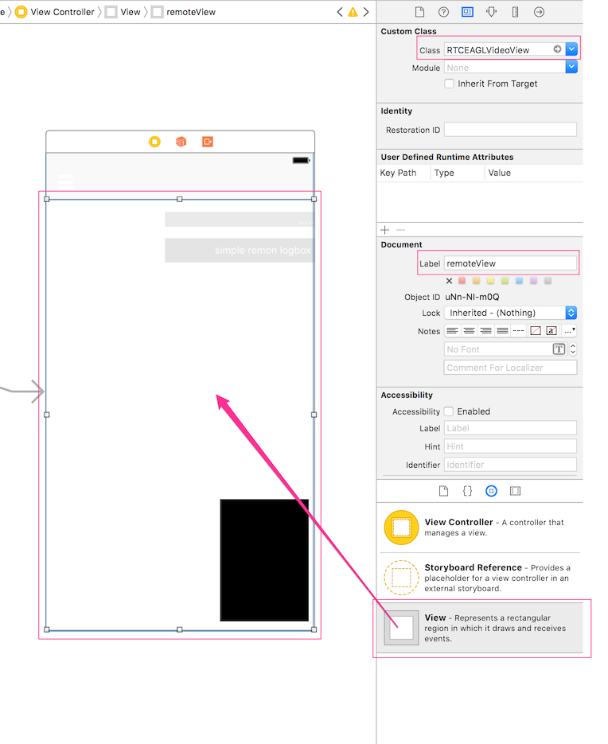

# iOS SDK - Getting Started

## 준비 사항
- Xcode 개발 환경
- iOS 9.2 이상

## 프로젝트 생성 및 설정
- Xcode에서 Swift기반의 프로젝트를 하나 생성합니다.
- 프로젝트 생성 후 Build Settings에서 bitcode에 대하여 No를 설정해야 합니다. (Remon SDK 0.1.6 부터는 bitcode를 지원함)


- 또한 Info.plist에서 다음 항목에 대해 추가 혹은 변경을 해주셔야 합니다.
  - Privacy: Bluetooth, Microphone, Camera


## RemoteMonster iOS SDK import하기
- 다운로드받은 RemoteMonster iOS SDK를 압축을 풀면 2개의 Framework이 존재합니다. 각각의 Framework을 Finder에서 끌어다 프로젝트 트리창에 놓습니다. 그러면 RemoteMonster iOS SDK를 프레임워크로 인식하게 됩니다.




## 레이아웃 구성
- 스토리보드에서 원하는 Scene에서 적당히 버튼을 배치하고 영상통화를 할 경우 다음과 같이 View하나를 화면에 위치시킨 후 그것의 Class를 RTCEAGLVideoView로 지정합니다.



- 이제 거의 완료되었습니다. 전체적인 화면 구성은 다음과 같습니다.


## 개발
- 개발은 생각보다 간단합니다. ViewController를 선택하여 다음과 같이 코드를 작성합니다.

```swift
import UIKit
import remonios
import WebRTC

class ViewController: UIViewController, RemonDelegate {

    var remon:Remon?
    var localVideoTrack:RTCVideoTrack?
    var remoteVideoTrack:RTCVideoTrack?

    @IBOutlet weak var remoteView: RTCEAGLVideoView!
    @IBOutlet weak var localView: RTCEAGLVideoView!

    override func viewDidLoad() {
        super.viewDidLoad()

    }

    override func didReceiveMemoryWarning() {
        super.didReceiveMemoryWarning()
    }

    @IBAction func onClickConnectButton(_ sender: Any) {
      let config = RemonConfig()
      config.key = "1234567890"
      config.serviceId = "SERVICEID1"
      remon = Remon(delegate: self, config: config)
    }

    @IBAction func onClickDisconnectButton(_ sender: Any) {
      remon?.disconnect()
    }

    func onStateChange(_ state:RemonState){
        switch state{
        case RemonState.INIT:
          remon?.connectChannel(chId: "demo1")
        case RemonState.CLOSE:
          close()
        case RemonState.FAIL:
          close()
        default:
          print("Unknown state")
        }
    }
    func didReceiveLocalVideoTrack(_ localVideoTrack:RTCVideoTrack){
        print ("local video track is occured")
        self.localVideoTrack = localVideoTrack
        self.localVideoTrack?.add(localView)
    }
    func didReceiveRemoteVideoTrack(_ remoteVideoTrack:RTCVideoTrack){
        print ("Remote Video Track is occured")
        self.remoteVideoTrack = remoteVideoTrack
        self.remoteVideoTrack?.add(remoteView)
    }

    func onError(_ error:Error){
        print ("Error: \(error)")
    }
    func onMessage(_ message:String){

    }
    func onDisconnectChannel(){
      close()
    }
    func onSearch(_ result:Array<[String:String]>){
      for ch in result{
        print(ch["id"])
      }
    }
    func close(){
      remon?.disconnect()
      if let rvt = self.remoteVideoTrack{
        if (rvt.accessibilityElementCount())>0{
          rvt.remove(remoteView)
        }
      }
      if let lvt = self.localVideoTrack{
        if (lvt.accessibilityElementCount())>0{
          lvt.remove(localView)
        }
      }
    }
}
```


## import 그리고 주요 클래스
- Remotemonster의 iOS SDK를 사용하기 위해서는 일단 remonios와 WebRTC를 import하여야 합니다.
- 다음은 Remotemonster SDK의 주요 클래스입니다.
- Remon
  - Remon은 가장 핵심이 되는 클래스입니다. 이를 통해 RemoteMonster의 대부분의 기능을 실행합니다. 초기화하고 연결하고 종료하는 일련의 명령을 수행합니다.
- RemonDelegate
  - RemoteMonster의 이벤트를 처리하는 protocol입니다. Remote Monster를 통해 오고가는 모든 통신과정의 이벤트를 수신할 필요가 있습니다. 이를 위해 RemonDelegate를 사용합니다.
 - RemonDelegate를 통해 처리해야하는 메소드는 다음과 같습니다.
   - onStateChange: 최초 Remon객체를 만들고 방을 만들며 접속하고 접속에 성공하고 통신을 마칠 때까지의 모든 상태 변화에 대해 처리하는 메소드입니다. RemonState 객체를 통해 어떤 상태로 변경되었는지를 알려줍니다. RemonState의 상태는 다음과 같습니다.
      - INIT(시작), WAIT(방 생성), CONNECT(방 접속), COMPLETE(통신 연결완료), FAIL(실패), CLOSE(종료)
      - 특히 INIT이 발생하는 시점에 Remon 객체가 제대로 할당되었다는 뜻이므로 만약 Remon객체를 생성하자 마자 바로 Connect하고 싶다면 이 때 바로 connect명령을 실행하면 좋습니다.
   - onError: 통신 시도 중 장애 발생시 호출됩니다.
   - didReceiveLocalVideoTrack: 자기 자신의 카메라의 영상이 혹은 음성 스트림을 획득하였을 경우 호출됩니다.
   - didReceiveRemoteVideoTrack: 상대방의 영상이나 음성 스트림을 획득하였을 경우 호출됩니다. 연결이 되었다는 뜻이죠.
   - onDisconnectChannel: 상대편이 연결을 명시적으로 끊을 경우 발생합니다.
   - onError: 에러가 발생할 때 에러 메시지와 함께 발생합니다.
   - onSearch: 만약 Remon클래스의 search명령을 실행하였다면 이 메소드로 그 결과값이 반환됩니다.
   - onMessage: 상대편이 나에게 Text메시지를 보냈을 경우 이 메소드로부터 메시지가 반환됩니다.
- RemonConfig
  - Remon을 init하기 전에 Remon을 사용하기 위한 설정을 하는 클래스입니다. secretkey를 설정하거나 serviceId를 설정하고 영상통화를 사용할지 여부 등을 설정합니다.
